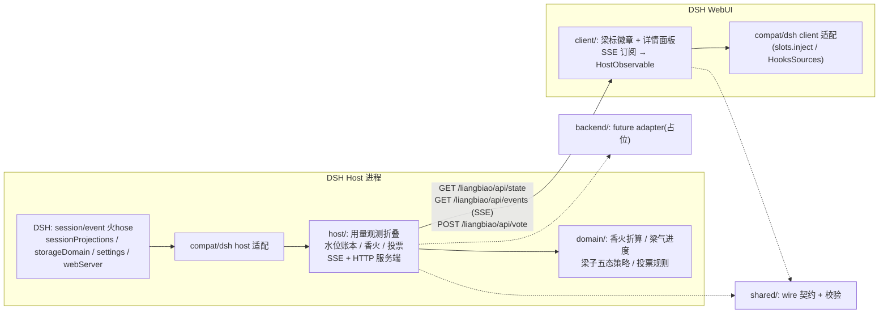

# 002 — 梁标首选架构

依据:[`docs/000`](000-dsh-reference.md)(版本基线)、[`docs/001`](001-dsh-integration-spike.md)(API 证据)。本文只做设计,不含实现。所有 DSH 触点的分级与降级路径在 [`docs/003`](003-compatibility-matrix.md);未决风险在 [`docs/004`](004-open-risks.md)。

> **R2 语义修订(2026-08-16)**:本文写于旧产品语义时期。DSH 技术事实(触点、事件、投影、通道、存储)仍有效;但涉及梁标业务语义处已按 [`PRODUCT_FREEZE_V0.1.md`](PRODUCT_FREEZE_V0.1.md) 就地修订——旧「梁签 / tokensPerBallot / cacheRead×0.1 / per-request cap / 目标模型口径」模型全部废弃,见 [`SEMANTIC_CORRECTION_R2.md`](SEMANTIC_CORRECTION_R2.md)。

## 1. 产品回顾(冻结契约的架构映射)

梁标(`dsh-liangbiao`)把 DSH 的 Input+Output Token 折算为个人香火(默认 50,000 Token = 1 炷),用户对当天唯一二元梁案投「夯/拉」(1 票 = 1 炷,夯/拉共用一个香火池);全网夯率唯一决定中央梁子的待开梁/五态;个人剩余香火 + 距下一炷 Token 进度构成梁气。悬停文案恒为 `今日梁位`。v0.1 仅 DSH WebUI 插件;Host 拥有权威本地状态,浏览器只是视图与命令面;离线必须可渲染。

## 2. 分层与代码布局(首选)

单 npm 包 `dsh-liangbiao`,双面(Host + Web Client),目录即分层:

```
dsh-liangbiao/
├── package.json            # dsh.bundle + dsh.client + exports(见 §3)
├── cordis.patch.yml        # 插入 host 插件行
├── tsdown.config.ts        # Host ESM + Client CJS factory 两个产物
└── src/
    ├── domain/             # 纯 TS,零依赖(不 import React/DSH/Node API)
    ├── shared/             # host↔client wire 契约 + 校验(纯 TS,可被两半 import)
    ├── host/               # Host 插件本体(仅经 compat 触碰 DSH)
    ├── client/             # 浏览器半(仅经 compat 触碰 DSH client API)
    ├── compat/dsh/         # 唯一允许直接 import/触碰 DSH API 的层
    └── backend/            # future backend adapter:仅接口占位,v0.1 不实现
```



层间红线:

- `domain/` 不 import 任何其他层;函数纯、可独立测试。香火折算(`tokenPerIncense`)、梁气进度(remainder/fill/toNext)、梁子五态阈值策略、投票规则全部在此。
- `shared/` 只含可序列化类型与解析校验(手写窄校验或本地小实现,不为此加依赖);两半共同的 wire 单一事实源。
- `host/`、`client/` 不直接 import DSH 符号;所有 DSH 触点收敛为 `compat/dsh/` 中一个个具名适配函数(每个触点一个函数,对应 `docs/003` 一行)。
- `backend/` v0.1 只定义 `VoteBackend` 接口占位(提交投票、拉取社区快照,均带超时/取消/幂等键),不做任何实现与网络调用。

## 3. 打包与安装形态

`package.json` 关键字段(依据 001-Q2):

```json
{
  "name": "dsh-liangbiao",
  "type": "module",
  "main": "lib/index.js",
  "exports": {
    ".": "./lib/index.js",
    "./client": "./lib/client.js",
    "./package.json": "./package.json"
  },
  "files": ["lib", "cordis.patch.yml"],
  "dsh": {
    "bundle": { "patch": "./cordis.patch.yml" },
    "client": { "platform": "web" }
  }
}
```

- `cordis.patch.yml` 只插入一行 host 插件(`- insert: [{ id: liangbiao, name: dsh-liangbiao }]`);Client 半由 `dsh.client` 清单扫描自动接入,无需额外行。
- 浏览器产物必须是 `window.__ModuleLoader__.load({ id, factory })` CJS factory 包装(树内 `clientBundle` preset 不对外发布,需在本包 tsdown 配置里复刻 banner/footer;此为半公开触点,见 `docs/003` 第 C6 行)。
- 发行:优先 npm/tarball(免 `prepare` 放行);git 安装作为开发路径,包内自带自包含 `prepare`。
- 安装:`dsh plugin --profile <name> add dsh-liangbiao`;因声明了 `dsh.bundle`,CLI 自动把包名追加进 `dsh.profile.bundles`。
- 开发环:`tsdown --watch` 持续写 `lib/client.js`,由 web 组合默认挂载的 HMR stat-poll 热替换;Host 半改动重启 `dsh web`。

## 4. Host 端设计

### 4.1 用量观测与记账管线

事实源(001-Q9):`session/event` 火hose上的 `assistant/chunk`(usage chunk)与 `assistant/message.usage`;路由归因(001-Q11):同会话 seq 序上最近的 `request/header`/`request/context`。

记账规则(全部在 `domain/` + `host/` 实现,规则序号供测试引用):

| # | 规则 | 依据 |
|---|---|---|
| R1 | 只处理火hose上的新 append(seed 不发布,天然不重放) | 001-Q8 |
| R2 | 每会话维护 `counted` 水位:`(sessionId, lastCountedSeq, pending)`;`event.seq <= lastCountedSeq` 一律丢弃 | 001-Q12 |
| R3 | 首次见到某会话(账本无水位)即基线化:`lastCountedSeq = session.seq - 1`,不补记既往——满足「不追溯授予」与 fork 前缀防双计 | 001-Q12 |
| R4 | 同 `(turn, step)` 后样本替换前样本(chunk ↔ 最终 message),不累加;复刻 token-meter 折叠语义 | 001-Q10 |
| R5 | **(R2 修订)** `effectiveTokens = (uncachedInput + cacheRead + cacheWrite) + output`,三个输入桶全额计入,reasoning 已含于 output 不另加;无 per-request cap | AGENTS.md §5(R2 冻结公式) |
| R6 | **(R2 修订)** `earned = floor(effectiveTokensToday / tokenPerIncense)`,`tokenPerIncense` 默认 50,000、取自梁案配置;余数即梁气环进度(不"铸签") | AGENTS.md §5 |
| R7 | **(R2 修订)** business date 切换:当日 Token/香火账目从新日重新开始,水位保留(防止旧用量复活) | AGENTS.md §10 |
| R8 | 结算时机:收到某 `(turn,step)` 的 usage 样本先入 pending(可被同步替换),在 `step/end` 或该会话下一个更晚 `(turn,step)` 的 usage 到达时定格结算并推进水位 | R4 的替换窗口需要 |

V0.1 口径(哪些样本可计入)见 §6:全部 DSH provider-reported 用量,无目标模型过滤。

### 4.2 本地状态(storageDomain)

`defineDomain({ name: 'liangbiao', version: 1, tables: … })`,经 `ctx.storageDomain.open()` 落 `$DSH_HOME/storages`(001-Q13)。逻辑表(R2 修订后):

- `case_state`:活跃梁案 id、配置快照(`tokenPerIncense`)、business date。
- `session_watermarks`:`sessionId → 已计入水位`(R2/R3)。
- `daily_usage`:按 business date 聚合的当日 input/output/effective Token。
- `personal_ledger`:当日 used incense、投票幂等记录(1 票 = 1 炷)。
- `identity`:梁标自铸匿名安装 id(UUID v4,仿 `dsh-anonymous-user-id` 的存储姿态但**不复用**其 id,避免与 telemetry/provider 关联;见 `docs/004` 隐私项)。
- `remote_snapshot`:缓存的全局快照(香火=总接受票、香客=独立参与用户;离线渲染用)。

用户偏好(非账本)走 `ctx.settings.register('liangbiao', schema)`:徽章显隐、贴边偏移等。

### 4.3 Host↔Client 通道(自建 HTTP + SSE)

`ctx.webServer.register`(001-Q6)三个端点,路径前缀 `/liangbiao/api/`:

- `GET /liangbiao/api/state`:全量快照(梁案、全局快照[比例+梁子状态同版本]、个人梁气、单调 `revision`)。
- `GET /liangbiao/api/events`:SSE 增量推送(快照变化即推新 `revision` 帧;重连由客户端先 GET state 再挂 SSE,revision 落后帧丢弃)。
- `POST /liangbiao/api/vote`:`{ caseId, voteType: "up"|"down", requestId }`;同键重放返回首次结果;一票消耗一炷香。

wire 类型与校验在 `shared/`;Host 对入站 body 逐字段校验(边界校验原则)。不触碰 ApiProxy/HostFrame 封闭词表;不用 `@Remote`(树外不可用,001-Q6)。

## 5. Client 端设计

- 注册:`ctx.slots.inject('shell.overlay', () => ctx.slots.register({ name: 'shell.overlay', id: 'liangbiao', order: 100, inject: … }, Badge))`(001-Q3/Q4/Q5)。贴右由条目自身 CSS 定位(overlay 层 `inset:0` click-through,条目 `pointer-events:auto`),避开 composer/导航,不遮挡 `details` 右栏常用区。
- 数据:`client/` 内一个连接模块封装 `GET state` + SSE 订阅(指数退避、上限重试、AbortController),把快照暴露为 `HostObservable`(`getSnapshot`/`subscribe`)放进 inject 的 `hooks` 隔间 → 组件经框架生成的 `use<Name>` hook 读取;投票回调同经 inject face 下发。组件本身零订阅机(client AGENTS.md 纪律)。
- root scope 组件没有 `useProjection` 标准席位(001-Q4),因此梁气数据一律走上述自建通道,不在 client 侧读会话投影。
- 主题与可达性:只用 `var(--dsw-*)` 语义 token;暗色跟随 `body[data-ds-dark-theme]`;动画尊重 `@media (prefers-reduced-motion: reduce)`;悬停/聚焦均出 `今日梁位` tooltip;键盘可达(条目为 button,Enter 展开详情面板)。梁气环四阶段(0–69 冷调、70–89 暖调、90–99 朱红、100 一次完成动画后稳态)在 CSS 变量上实现,资产为原创 CSS/SVG。
- 点击开单个紧凑详情面板(仍在本条目内渲染,不新开 slot、不用 body portal),再次点击/Escape 关闭。

## 6. 用量口径(R2 修订)

**V0.1 冻结:不做目标模型过滤(no TARGET_MODEL filter)**——用户当日所有 DSH provider-reported 用量都计入香火。因此旧"方案 A(精确目标模型归因)"推迟到产品层重新引入目标模型语义之时;V0.1 采用原方案 B 的观测通道:

- **可计入判定**:订阅 `ctx.sessionProjections.onChanged` 过滤 key `tokenUsage`,对每会话取累计 `TokenUsageProjection`,与账本中该会话"已计累计值"(水位)做差分,差分经 R5 公式折算并按观测时的 business date 入账。首见会话基线化(记当前累计值,不补记)。
- **前提**:组合挂载了 token-meter + session-projection(web 组合默认;两者缺任一时梁标显示"记账不可用"但 UI 仍渲染)。
- **优点**:直接继承 token-meter 的 chunk/final 替换去重与 replay 幂等语义(001-Q10/Q12),无需自建折叠器。
- 旧 per-request cap 已随 R2 语义废弃;无近似问题。

## 7. 离线与失败姿态

- 无网络(v0.1 常态,无后台):徽章与详情面板完全本地渲染;香火/香客显示缓存值或"—"。
- SSE 断连:徽章保留最后快照并标记 stale;重连成功刷新。
- storageDomain 写失败:遵循 DSH fail-soft 先例(记警告,内存态继续,下次写自愈);不静默吞异常。
- 会话日志出现未知必读事件导致某能力缺席时,梁标显示"记账暂停"而非猜测。

## 8. Future backend adapter(占位)

`backend/` 仅定义接口,v0.1 无实现、无网络调用:

```ts
interface VoteBackend {
  submitVote(v: { requestId: string; caseId: string; voteType: 'up' | 'down' }, signal: AbortSignal): Promise<SubmitResult>
  fetchGlobalSnapshot(caseId: string, signal: AbortSignal): Promise<PublicLiangSnapshot>
}
```

接入时:调用只从 Host 发起;超时/取消/有界重试;所有远端数据经 `shared/` 校验;传输内容仅限投票意图与聚合计数(见 §9)。软信任声明:本地 Token→香火是社区软信任机制,不是模型用量的密码学证明,任何文案不得夸大;production 票权 authority 要求见 AGENTS.md §9。

## 9. 隐私红线映射

永不记录/传输:prompt、模型输出、代码、文件内容/路径、API key、凭据、原始会话日志、精确原始 token 历史。落地:

- Host 折叠器只保留聚合计数与水位,不落任何事件内容;`session_watermarks` 只有 id 与 seq。
- wire 快照只含梁案/全局快照/个人梁气(香火计数与 Token 聚合计数)。
- 匿名安装 id 自铸,不复用 `.anonymous-user-id`(避免与 telemetry/DeepSeek 请求头关联)。
- 日志(console/warning)不得包含事件 payload。
