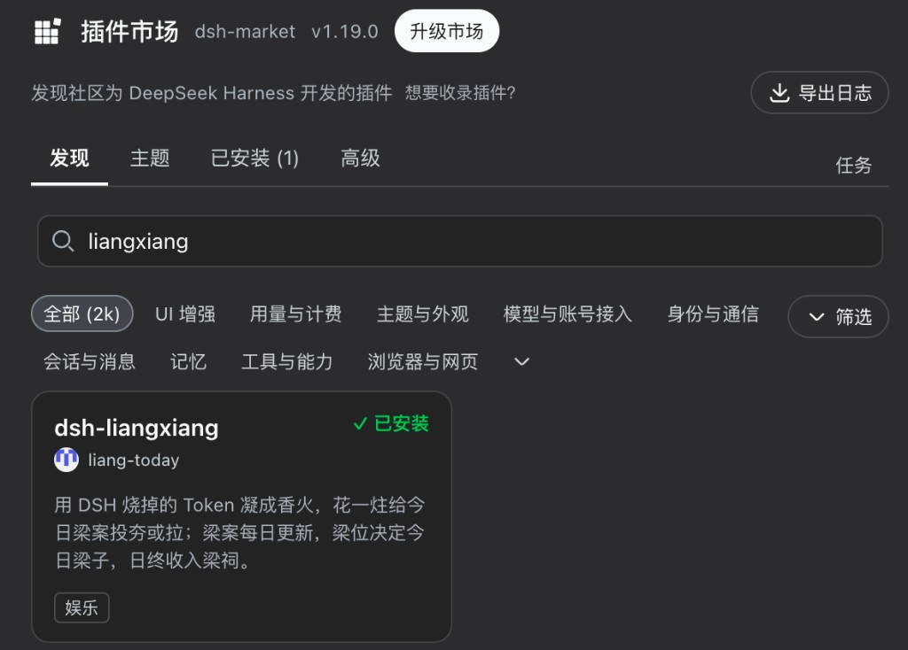

# INSTALL — 安装与运行

前置：插件本身**不绑定**特定 DSH / Node 版本，也不需要任何 API key（只有在 WebUI 里真正和模型对话才需要）。DSH 宿主自己可能仍要求 Node 22.19+；自建社区后端需要 Node 自带的 `node:sqlite`（约 22.5+）。

全程先**完全退出** DeepSeek Harness WebUI，做完再启动，浏览器刷新一次。卸载和升级都**不删除**香火账本。

## 用户：安装 / 升级 / 卸载

DSH 有两种用法。全局装过 CLI 就写 `dsh`；否则每次用 `npx --yes @deepseek-ai/dsh` 替换下面的 `dsh`。`web` 若不是你的 profile 名，换成实际名字。

```bash
dsh …                                    # 全局模式
npx --yes @deepseek-ai/dsh …             # 没有全局 dsh 时
```

### 插件市场（推荐）

打开 WebUI → **设置 → 插件市场** → 搜索 `liangxiang` → 安装。

如果还没有插件市场：

```bash
export DSH_HOME="$HOME/.dsh"
npx --yes @deepseek-ai/dsh plugin --profile web add dshmarket
npx --yes @deepseek-ai/dsh web
```

用 DSH Desktop 时，先把 `DSH_HOME` 指到桌面自己的 harness，再装。



也已列入 [1024 Store](https://deepseek1024.com/) 和 [awesome-deepseek-harness](https://github.com/Dominic789654/awesome-deepseek-harness)。安装仍按上面的 dsh-market 走。

已装过旧 `@beta` 时：打开同一市场 → **检查更新**（或卡片上的更新）。市场比的是 npm `latest`（`1.0.0` 高于 `0.8.6-beta`）。点更新后刷新；看不到更新就强制检查一次（缓存大约 30 分钟）。

### npm（命令行）

安装和升级都写无标签包名，解析 npm `latest`，不要钉 `@beta` 或某一号：

```bash
export DSH_HOME="$HOME/.dsh"
npx --yes @deepseek-ai/dsh plugin --profile web add dsh-liangxiang
```

插件本身没有收窄的版本范围。Host 启动时只改清单：精确号、本地 `.tgz`、残留的 `beta` 一律改成 `latest`，并在 profile 的 `pnpm-workspace.yaml` 写入：

```yaml
minimumReleaseAgeExclude:
  - dsh-liangxiang
```

这是为了躲开 pnpm 11 默认 24 小时发布冷静期，并让以后升级继续走同一条命令。启动不跑 `pnpm add`。未启动过带此逻辑的 Host 时，也可以自己把上面两行加进 `$DSH_HOME/profiles/web/pnpm-workspace.yaml`，再执行一次 `add dsh-liangxiang`。旧书签里的 `add @beta` 仍能装到正式包，但文档不再教这条。

卸载：`npx --yes @deepseek-ai/dsh plugin --profile web remove dsh-liangxiang`

国内 npm 慢时：`npm config set registry https://registry.npmmirror.com`

> 源码本点是 `dsh-liangxiang@1.0.2`。请写无标签包名；不要写 `@0.8.0`。npm `latest` 随后切到本号。不要运行 `npm i dsh-liangxiang`，那不是 DSH 插件安装方式。

### GitHub Release / 本地 tarball

先进入安装包目录，再写 **`./文件名.tgz`**。少写 `./` 会去 npm 拉这个文件名，报 `ERR_PNPM_FETCH_404`。子命令是 `plugin add`。

```bash
export DSH_HOME="$HOME/.dsh"
cd "$HOME/Desktop/liangxiang"
npx --yes @deepseek-ai/dsh plugin --profile web add ./dsh-liangxiang-1.0.2.tgz
```

卸载：`npx --yes @deepseek-ai/dsh plugin --profile web remove dsh-liangxiang`

卸掉再装**不会**自动回到欢迎页。欢迎标记在浏览器 `localStorage`，与插件是否安装无关。重装后在本页控制台执行：

```js
localStorage.removeItem('liangxiang:welcome:v2')
location.reload()
```

### DSH Desktop

Desktop 读的是自己的家目录。不设 `DSH_HOME` 时，命令会写进 `~/.dsh`，界面上看不见入口。

先完全退出 Desktop。Windows PowerShell：

```powershell
$env:DSH_HOME = "$env:APPDATA\dsh-desktop\harness"
$env:PATH = "$env:DSH_HOME\.desktop-bin;$env:PATH"
dsh plugin --profile web add dsh-liangxiang
```

Desktop 自带 pnpm 10（`%DSH_HOME%\.desktop-bin`）。本机 PATH 上的 pnpm 11 会报 `ERR_PNPM_UNEXPECTED_STORE`。不要用全局 `dsh` 对着默认 `~/.dsh` 装完再指望 Desktop 看见。

### 源码（开发 profile，不改日常 `~/.dsh`）

```bash
git clone https://github.com/liang-today/dsh-liangxiang.git
cd dsh-liangxiang
pnpm install && pnpm run dev:install && pnpm run dev:web   # 安装
git pull && pnpm install && pnpm run dev:install           # 升级
pnpm run dev:uninstall                                     # 卸载
```

## 国内网络

- **npm**：`@deepseek-ai/dsh` 与 `dsh-liangxiang` 都在 npmjs，也被 npmmirror 同步。若官方源超时，可改用：

  ```bash
  npm config set registry https://registry.npmmirror.com
  ```

  或单次：`npm_config_registry=https://registry.npmmirror.com dsh plugin --profile web add dsh-liangxiang`
- **社区后端**：本机 DSH Host 直连 `https://api.liang.today`。内地一般可访问，偶发跨境抖动时插件会在 3 秒内放弃等待、进入 DSH 主界面，并显示「无法连接天庭」，后台继续重连。
- **官网 / GitHub**：`liang.today` 是 GitHub Pages；源码自编译依赖 GitHub。这两条在内地可能较慢或不可达，优先走 npm `latest`。
- **离线兜底**：连不上社区时不要改 registry 以外的配置；在梁相案牍手动选离线模式即可本机自玩。

## 一、从仓库开发运行（推荐）

```bash
pnpm install
pnpm run dev:install     # 构建 + 装入 liangxiang-dev profile（含模块图断言）
pnpm run dev:web         # 启动 WebUI，默认 http://127.0.0.1:3080
```

右缘会出现一个圆形入口，图标就是当前梁子状态，悬停显示 `今日梁相`；可以拖到任意位置。

默认是在线（烘焙社区后端）。首次欢迎页或「梁相案牍」可手动切换在线/离线；断网不会自动切换。`LIANGXIANG_BACKEND_URL=local` 只设置尚无保存偏好时的首次离线默认。离线模式可用 CLI 模拟入账：

```bash
LIANGXIANG_BACKEND_URL=local pnpm run dev:web   # 终端 A：首次默认离线
pnpm run dev:credit                            # 终端 B：+1 炷
pnpm run dev:credit -- 9                       # +9 炷
```

想跑自建在线链路：

```bash
# 终端 A
LIANGXIANG_BACKEND_DB=.liangxiang-backend/dev.sqlite pnpm run backend:start   # http://127.0.0.1:4180
# 终端 B
LIANGXIANG_BACKEND_URL=http://127.0.0.1:4180 pnpm run dev:web
```

此时 authority mode 变为 `DEV_STAGING_ONLY`（服务端记账的社区软信任，见 [`075`](075-backend-decision.md)）。公网 VPS 配方见 [`121-vps-deploy.md`](121-vps-deploy.md)。

一键自检：`pnpm run smoke:online`（会断言拒绝 `VERIFIED_PRODUCTION`、claim 折算、幂等只扣一次、50 并发只接受 1 票、快照发布）。

离线玩法第一次启用时会创建 `<DSH_HOME>/storages/liangxiang_local.json`，保存离线香火、打梁、梁案进度和梁祠；社区身份与在线投影仍在 `liangxiang.json`。两边不会互相导入。

## 二、开发者打包注意

```bash
pnpm pack
dsh plugin --profile <你的 profile> add ./dsh-liangxiang-1.0.2.tgz
```

1. **不要**把 in-box bundle（如 `@deepseek-ai/dsh-web-app`）装成 profile 依赖。它只需要出现在 `dsh.profile.bundles` 里；装进 `<profile>/node_modules` 会遮蔽 launcher 的模块回退目录，造成同一个包出现两个实例，工具调用会直接报 `Cannot read properties of undefined (reading 'prepare')`。装完可以跑 `node scripts/assert-profile-modules.mjs <DSH_HOME>/profiles/<profile>` 自检。
2. **tarball 不含后端**（`lib/backend.js` 不在包内，插件包只有 Host + Client 两半）。默认在线模式直接连接梁相社区；只有自建社区节点时，才需要从仓库部署后端。

## 三、环境变量

全部可选，见 [`.env.example`](../.env.example)。最常用：

| 变量 | 作用 |
|---|---|
| `LIANGXIANG_BACKEND_URL` | 默认烘焙社区地址（在线）。`local` 只设置无持久化偏好时的首次离线默认 |
| `LIANGXIANG_TOKEN_PER_INCENSE` | 每炷香的 Token 数（默认 50,000；调小便于演示） |
| `LIANGXIANG_SNAPSHOT_SECONDS` | 快照/轮询节奏（默认 1s） |
| `LIANGXIANG_BUSINESS_TZ` | 业务时区（默认 `Asia/Shanghai`）；在线模式下**后端**的这项才是权威 |
| `LIANGXIANG_BACKEND_DB` | 后端 SQLite 路径（默认 `.liangxiang-backend/liangxiang.sqlite`，`:memory:` 可用） |
| `DSH_HOME` | 脚本默认用项目内 `.dsh-home`，不碰你真实的 `~/.dsh` |

普通卸载/更新不删除 `liangxiang.json` 或 `liangxiang_local.json`；后端数据就是配置的 SQLite 文件。
